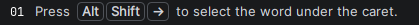
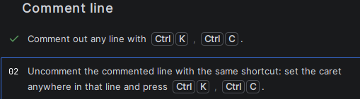
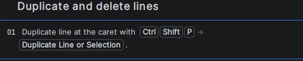
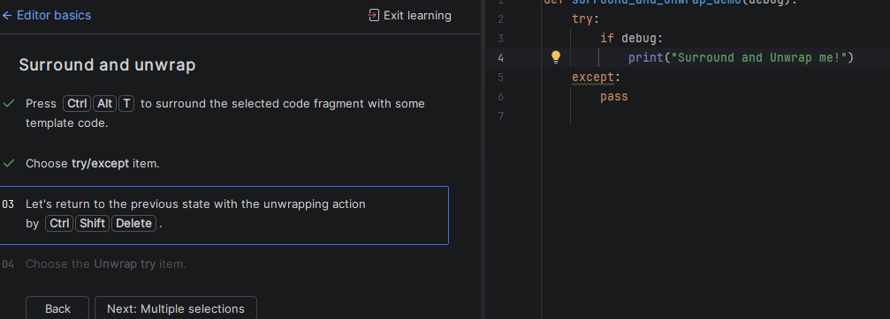
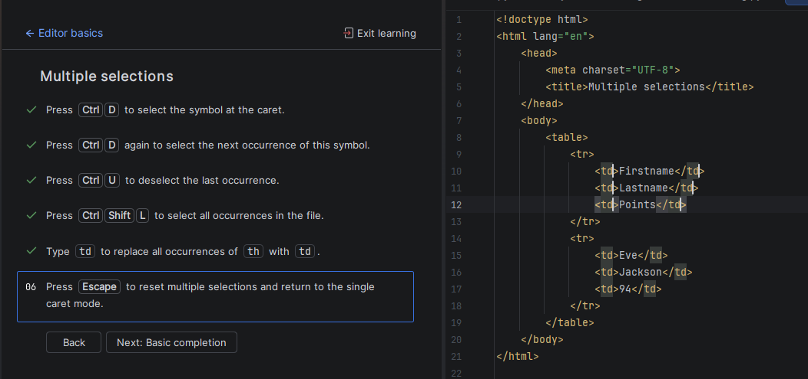
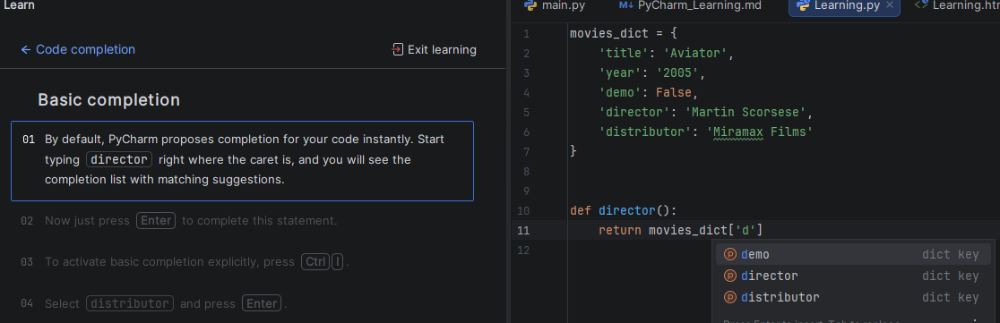
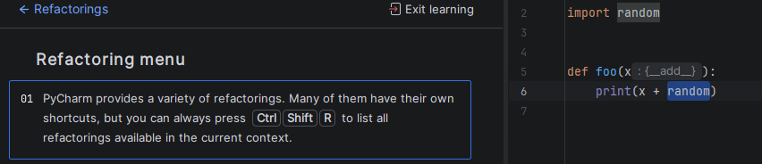
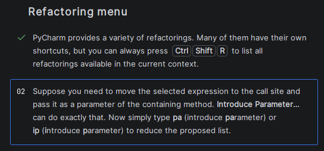

**ctrl + period** opens Show Context Action

**ctrl + shft + P**  used for Find Action

**double tap shift** is also Find Action

[indention actions](https://www.jetbrains.com/help/pycharm/intention-actions.html)

[refactoring 1](https://www.youtube.com/watch?v=wd1JqBWm3lQ)

[refactoring tutorial Pycharm](https://www.jetbrains.com/help/pycharm/product-refactoring-tutorial.html)

